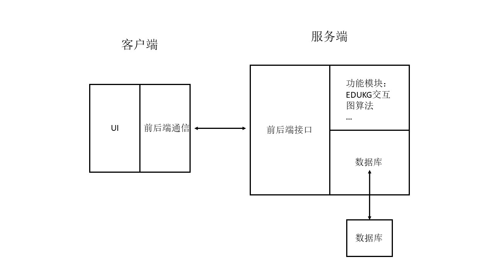
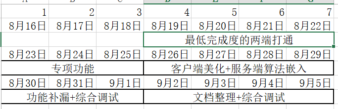

# Java大作业设计文档
孟本源 2018010527  
刘程华 2018011687  
宋俊澔 2019010432

## 附加功能选择
- 专项测试：直接使用EDUKG提供的接口
- 知识梳理：直接使用EDUKG提供的接口，可能需要一些额外的数据处理
- 知识联想
	- 提供两个实体，寻找两者之间的最短路，或者一些带有额外要求的搜索
	- 使用python算法端实现

## 人员分工
- 刘程华：客户端用户交互部分
	- 用户能够直接看到的UI，包含页面布局、必要的特效等
	- 分享收藏功能 (负责微博SDK注册)
- 宋俊澔：客户端通信部分
	- 放在客户端的前后端通信部分
	- 对后端提供的数据进行处理 (考虑到工作量的均衡，后端的功能进行一定的简化)
	- 本地缓存功能
- 孟本源：服务端
	- 给前端提供的接口
	- 与EDUKG的交互，算法端
	- 数据库 (主要涉及到用户注册、收藏等)

## 架构设计
- 客户端
	- 用户交互部分：UI，交互逻辑
		- 要点：好看
	- 通信部分：前后端通信
		- 调用后端提供的接口，形式一般是网络通信，也就是get/post
	- 其他：分享收藏，缓存等
- 服务端
	- 接口：提供给前端
	- 数据库
		- App全局信息
		- 用户信息维护
		- 收藏
	- 功能模块
		- 与edukg交互 (考虑到工作量和程序运行的负载，计划将数据处理部分放到客户端，服务端直接把请求到的原始数据转给客户端)
		- 算法端 (嵌入python)

  

## 工作计划
考虑到整体开发时间较短(参赛情况下以提交demo视频为ddl，比大作业的ddl提前大约一周)，选择以半周为周期的开发计划  
  
- 最低完成度的两端打通
	- 前端：符合基础需求的页面划分
	- 通信：保证数据正确所需的处理
	- 后端：接口部分和EDUKG交互部分
	- 注：本阶段连带完成附加功能的前两项，因为实现方式上和基础功能很接近
- 专项功能
	- 前端：分享收藏
	- 通信：本地缓存
	- 后端：注册和登录，可能涉及到数据库以及加密相关策略
- 客户端美化+服务端算法嵌入
	- 前端：页面布局美化，必要的特效
	- 通信：算法
	- 后端：算法，python嵌入相关
- 功能补漏+综合调试
	- 对照需求检查是否有遗漏的功能
	- 以能够录制完成demo视频为目标进行综合调试
- 文档整理+综合调试
	- 整理文档
	- 以系统整体正常运行为目标进行综合调试

## UI设计
见另一份文件  
