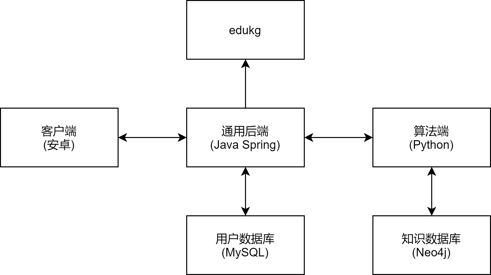
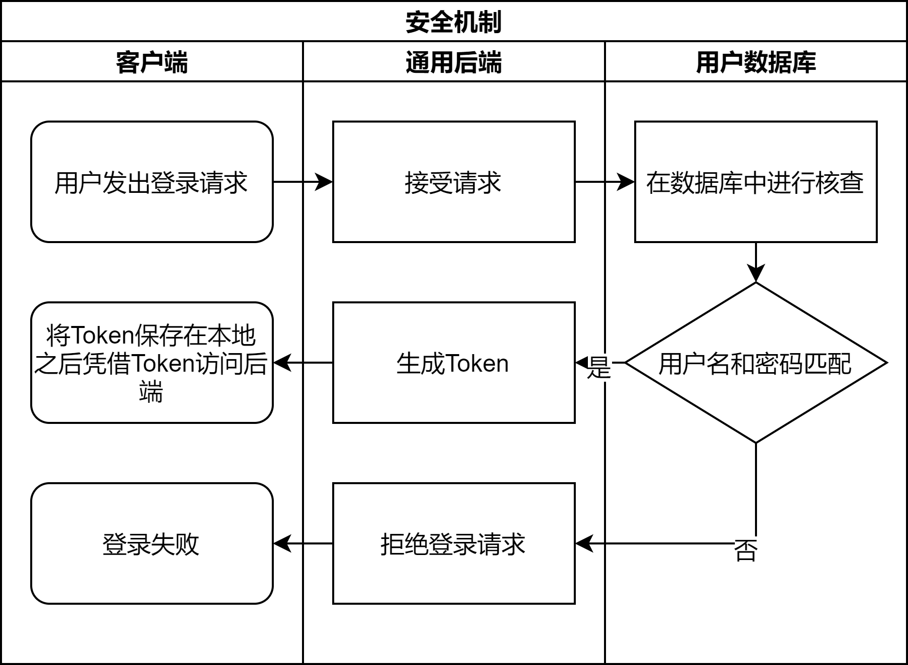
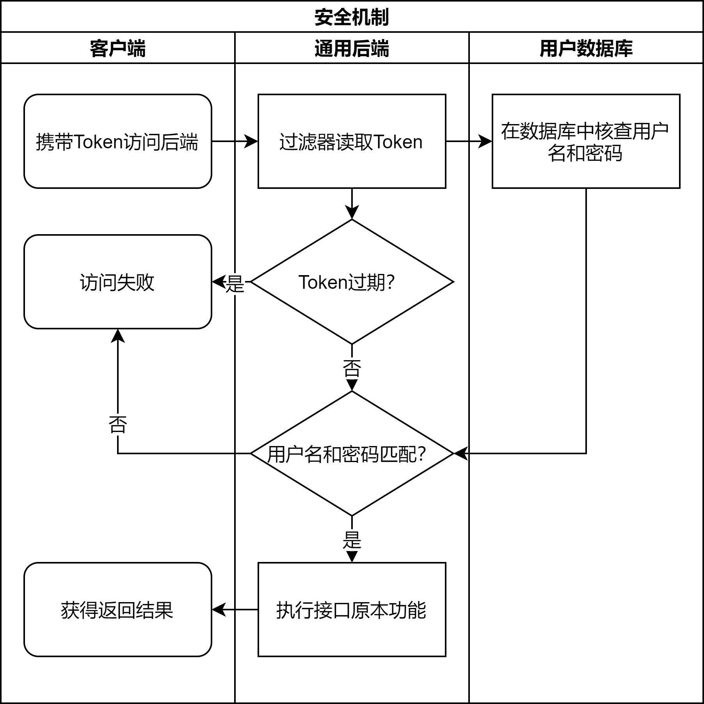

# 做个能用的学习软件 / EdukgApp
孟本源 刘程华 宋俊澔  

## 1 项目概述
本项目是一套基于知识图谱(Knowledge Graph)的学习类软件。  
就用户侧而言，本项目可提供一般学习软件所包含的知识点查看、知识问答等功能，也可以提供基于图谱实现的独特功能，以提供新的学习方式。  
就开发侧而言，本项目的主要功能均基于图谱实现，可以充分利用图算法寻找知识内部的关联。  

本项目中涉及到域名的部分，有些采用自定义域名解析，因此若要运行请先设置如下hosts:  
```
123.60.58.194 edukgappdb  # 用户数据库
127.0.0.1 edukgappserver  # 通用后端
```
因为我们的一些组件位于服务器上，而这些服务器并非长期租用，所以我们不保证一段时间后本项目仍可正常运行。  


## 2 需求分析
- 用户管理
	- 注册与登录，权限认证
	- 收藏
	- 历史记录
- 基础图业务：使用赛方提供的接口
	- 具体内容对照edukg的接口文档实现
- 拓展图业务：自行实现图算法
	- 推荐算法
	- 路径搜索
	- 大纲树抽取


## 3 系统架构
本项目采用多端分离的分布式架构，具体而言包括如下部分：  
  
- 客户端
	- 基于安卓实现
	- 主要面向移动端用户，这也是用户唯一可见的组件
- 通用后端
	- 基于Java Spring实现
	- 唯一与客户端进行直接交互的组件，根据客户端的交互请求，将其就地处理或转发至其他组件
- 算法端
	- 基于Python Flask实现，负责拓展图业务部分
	- Python与Neo4j的交互更加便捷
- 用户数据库
	- Mysql，负责用户管理部分
	- 存储用户名、密码、收藏、历史记录等基本信息
- 知识数据库
	- Neo4j，负责拓展图业务部分
	- 内容与下发的数据一致
- edukg
	- 赛方提供的组件，负责基础图业务部分


## 4 各模块详细说明
### 4.1 客户端
##### 主页
完成登录后进入主页，主页可以切换“首页”、“探索”和“我的”三个页面。首页主要展示学科分类列表，并可以进入搜索和知识问答页。探索页面可以进入知识链接、实体推荐、路径分析、知识大纲和历史数据页面。“我的”页面可以显示浏览数、做题数，并进入收藏、历史、本地缓存等页面，此外还可以在本页面清除缓存。
##### 实体详情页
从各个功能得到的实体列表中点击实体可以进入实体详情页。实体详情页会显示实体的名称、学科、属性和与其他实体的关系。通过这些关系可以跳转到对应的实体详情页。此外，实体详情页还提供实体相关的练习题。在实体详情页可以对实体进行收藏和分享。
##### 实体列表相关页面
- 主页的“首页”页面会显示学科分类列表，显示每个学科的相关实体。可以对学科进行添加和删除。
- 搜索页面会显示搜索结果列表。搜索需分学科，提供默认排序、按名称排序、按属性排序和浏览历史优先排序等多种排序方式。
- 本地缓存页提供本地浏览过实体详情页的实体列表，这些实体的详情页可以离线浏览。
- 历史页提供当前用户浏览的实体详情页的历史记录，这些实体由后端储存，根据当前登录用户给出。
- 收藏页提供当前用户收藏的实体。
- 实体推荐页会根据当前用户的浏览历史分学科推荐相关实体。
- 知识链接页会在用户输入的一段文本中寻找知识点，并给出相应的实体列表。
- 路径分析会找出两个实体之间的最多五条最短路径（路径上的相邻实体互相有关联），并给出每条路径的实体列表。

##### 其他页面
- 知识问答页：分学科进行知识问答，系统将回答用户用自然语言提出的学科相关的问题。
- 历史数据页：对用户过往浏览数的学科分布、过往的做题数和正确率等数据进行图表式的呈现。
- 知识大纲页：根据中心实体寻找两跳以内的其他实体绘制知识大纲图。

### 4.2 通用后端
#### 4.2.1 组件划分
- 安全 com.edukgapp.security
- 数据库 com.edukgapp.database
- 控制器 com.edukgapp.controller

#### 4.2.2 安全组件
##### 基本设计
基于JsonWebToken实现无会话的安全机制，具体工作逻辑如下：  
  
  
该机制允许后端不保存会话，用户可以任意在多个后端之间切换，而该过程对用户和后端而言都是透明的。这种设计可以有效降低后端的复杂性，并且有利于扩展。  
##### 实现方式
- JwtTokenUtil: 用于生成和解析JWT的各种工具
- JwtRequestFilter: 自定义的过滤器，从请求头中取出JWT进行检验，并根据检验结果将请求导向不同的处理组件
- WebSecurityConfig: 整体设置，将自定义的过滤器加入过滤器链中，以及进行其他设置
- 其他构成部分，均依托于上述三个主体组件展开

#### 4.2.3 数据库组件
##### 实现方式
使用Spring框架提供的JPA组件与Mysql建立连接并进行交互。  
在实现时，我们只需要为Mysql表建立一个对应的描述实体类，然后基于该类声明一个Repository接口即可。  
Spring为自动实现该接口，包含最基础的一些查询方法。可以按照特定的语法规则在接口中声明额外的查询方法，Spring依然可以自动实现。  
##### 具体的实体
- AppInfo: edukg的用户名和密码等
- Account: 用户账号
- Favorite: 收藏
- History: 历史记录

#### 4.2.4 控制器组件
##### 概述
控制器组件为Spring框架中的Controller类，用于接受网络请求。  
我们将请求分为三类，分别进行不同的处理。  
- 用户管理：与用户数据库交互
- 基础图业务：通过RestTemplate发送网络请求，转交给edukg处理
- 拓展图业务：通过RestTemplate发送网络请求，转交给算法端处理

虽然处理方式有所区别，但是对前端统一了交互方式，可以降低前端的开发复杂性。  
##### 接口说明
接口说明可在提交的后端代码根目录下看到(README.md)，我们认为不必将这些内容复制粘贴到这里。  

### 4.3 算法端
#### 4.3.1 服务器
基于Flask框架实现。  
现阶段没有给算法端设置复杂的安全机制。  
接口说明如下：  
##### post: /get-framework
参数：  
- uri: 中心实体的uri

返回值：
```
{
	'uri': '',
	'label': '',
	'rel': '', # 与上级实体关联的关系，以标签形式给出
	'sub': []
}
sub 中的每一项都递归采用相同的结构
```

##### post: /get-path
参数：
- s: 起点实体的uri
- t: 终点实体的uri

返回值：  
```
[
	[
		{
			'type': '',
			'uri': '',
			'label': ''
		},
		...
	],  # 这是一条路径
	...
]
```

##### post: /get-recommendation
参数：
- course: 学科代号
- hisotry: 历史记录列表，列表中每一项是一个uri

返回值：  
```
[
	{
		'uri': '',
		'label': ''
	},
	...
]
```

#### 4.3.2 与数据库交互
使用py2neo包连接Neo4j数据库，构造Cypher语句后直接使用graph.run()方法进行查询。  
#### 4.3.3 算法
##### 大纲抽取
首先搜索中心实体附近一跳的实体：  
```
match (s {uri: "%s"})-[r1]-(t1:Entity)
with s, r1, t1 limit 5
return r1.uri as r1, t1.uri as t1, s.course as course
```
然后以一跳实体为起点搜索两跳实体，同时避免搜索到重复结果。  
分两步搜索是因为Neo4j的执行逻辑存在限制，合并搜索可能导致完全拿不到结果。  
```
with source_list as source
match (t1)-[r2]-(t2:Entity)
where (t2.course = "%s") and (t1.uri in source) and (not t2.uri in source) and (t2.uri <> "%s")
with t1, r2, t2 limit 15
return t1.uri as t1, r2.uri as r2, t2.uri as t2
```
经过两步搜索后，结果中仍然可能存在环路结构，具体而言是从中心实体经过不同的一跳实体到达同一个两跳实体。因此用Python进行后处理，消除环路，形成支撑树。  
##### 路径搜索
使用Neo4j提供的最短路功能：  
```
match (p1:Entity {uri: "%s"}), (p2:Entity {uri: "%s"}),
path=allshortestpaths((p1)-[*..10]-(p2))
with path limit 5
return path
```

##### 推荐算法
推荐算法分为两部分，基于PageRank的全局推荐，和基于Jaccard指数的个性化推荐。  
全局推荐：使用gds插件的PageRank方法，分学科进行。  
```
call gds.pageRank.stream("%s")
yield score, nodeId
```
个性化推荐：Jaccard指数是评估两个集合之间相似性的常用方法之一。将用户历史记录实体及其附近一跳的实体作为一个集合，然后同学科内的每个实体及其附近一跳的实体各构成一个集合，将这些集合与历史记录集合分别求Jaccard指数，并将相似性较高且不存在于历史记录中的实体返回。  
```
with ' + history_str + ' as source

match (s)-[]-(s1:Entity) where s.uri in source
with source, s, collect(id(s))+collect(id(s1)) as sSet

match (t:Entity)-[]-(t1:Entity) where (t.course = s.course) and (not t.uri in source)
with sSet, t, collect(id(t))+collect(id(t1)) as tSet

with t, gds.alpha.similarity.jaccard(sSet, tSet) as similarity
return id(t) as t order by similarity desc
```

### 4.4 数据库
#### 4.4.1 用户数据库
使用Mysql搭建，仅依赖于Mysql的基本服务。  
该数据库需要频繁访问，且会发生频繁的修改，现阶段只有一个数据库，若要扩大业务规模则需要做分布式重构。  
#### 4.4.2 知识数据库
使用Neo4j搭建，需要额外的gds(Graph Data Science)插件。  
该数据库的修改频率很低，主要功能是以算法的形式提供查询服务。  
因为不需要考虑数据的并发写入，所以只需要简单地设置多个一样的知识数据库即可扩大业务规模。  
